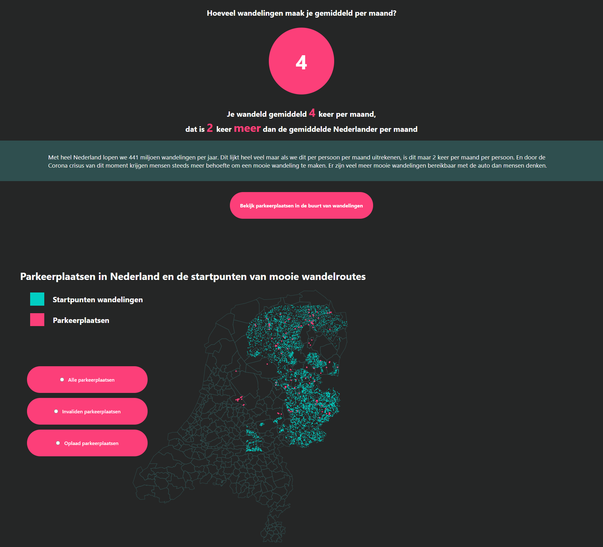
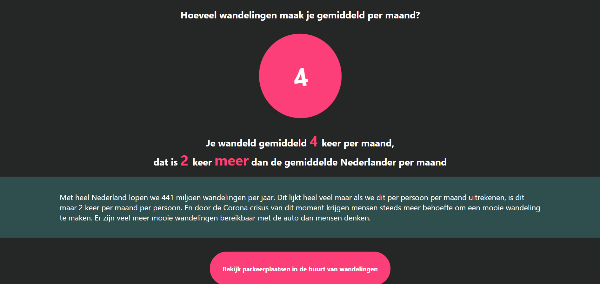
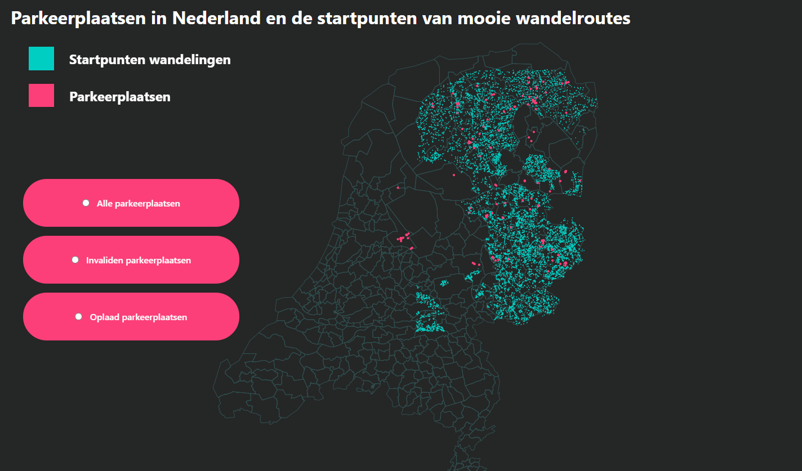

# frontend-applications

**functional-programming en frontend data 20/21**  
**Auteur:** _Simon Planje_  
[🔴 live gh-pages](https://simonplanje.github.io/frontend-applications/)

# Concept
  

Met heel Nederland lopen we 441 miljoen wandelingen per jaar. Dit lijkt heel veel maar als we dit per persoon per maand uitrekenen, is dit maar 2 keer per maand per persoon. Door de coronacrisis van dit moment krijgen mensen steeds meer behoefte om tussen het werken door lekker naar buiten te gaan. Er zijn veel mooie wandelingen bereikbaar met de auto. En wandelen is een van de beste manieren om tijdens de lockdown elkaar alsnog te kunnen ontmoeten in de buitenlucht.   

## Onderzoeksvragen

> **Waar in Nederland kan het best worden geparkeerd om direct bij een wandel- of fietsroute uit te komen?**
### Subvragen

- Waar lopen de wandelroutes door Nederland?
- Welke parkeerplaatsen liggen dichtbij wandelroutes?
- Bij welke parkeerplaatsen kunnen er invaliden mee met de wandeling?
- Bij welke parkeerplaatsen kan de elektrische auto worden opgeladen?
- ~~Bij welke parkeerplaatsen moet je betalen tijdens het wandelen?~~
- ~~Bij welke wandelroutes is de lucht het schoonst?~~

## Het concept

Om Nederland een zetje in de goede richting te geven met dit goede gedrag heb ik een interactieve datastory gemaakt aan de hand van de [RDW-data](https://opendata.rdw.nl/browse?category=Parkeren&provenance=official&page=1) en de [route-databank](https://kaarten.routedatabank.nl/index.php?@RaadplegenWandelroutes) data.   
Het is een interactief verhaal waar je als gebruiker doorheen wordt geleid en eindigd bij een visualisatie van alle parkeerplaatsen en wandelroutes door heel Nederland. De gebruiker komt er door de visualisatie achter hoeveel wandelingen er wel niet in Nederland zijn en dat veel van die wandelingen een parkeerplaats in de buurt hebben staan. 

## Features

1. Vergelijk jezelf met "de algemene Nederlander" als het gaat om hoevaak iemand er op uit gaat voor een mooie wandeling.  
De gebruiker kan invullen hoe vaak hij naar buiten gaat om te wandelen, vervolgens wordt dit vergeleken met hoe de gemiddelde Nederlander dat op dit moment doet volgens [deze bron](https://www.wandelnet.nl/kwaliteitsmonitor-wandelen-provincies).


2. Daarna komt de visualisatie in beeld en kan de gebruiker echt zien waar de parkeerplaatsen en wandelroutes door Nederland lopen. Ook kan de gebruiker filteren op of er een invalide plek of een oplaadpaal moet zijn.   



## Datasets
1. [Route databank](https://kaarten.routedatabank.nl/index.php?@RaadplegenWandelroutes)  
    - Longitude
    - Latitude
    - Afstand - hoelang is de wandeling
    - Plaats - in welke plaats/ gebied ligt de wandeling

2. [RDW-Data](https://opendata.rdw.nl/browse?category=Parkeren&provenance=official&page=1)
    - Longitude
    - Latitude
    - Chargingpoint - Heeft de parkeerplaats een oplaadpunt voor elktrische auto's
    - DisabledAccess - Heeft de parkeerplaats plaatsen voor invaliden

# Clone dit project

1. Clone de repository in de terminal

```git
git clone https://github.com/SimonPlanje/frontend-applications.git
```

2. Open de bestanden in VScode
4. Open de terminal in het bestand waarin je de repo hebt gecloned
5. Gebruik in de terminal het script `npm install`
6. Gebruik als npm install klaar is het script `npm start`. Dit zal de applicatie automatisch openen op een localhost:3000
7. Nu start er een live versie van de applicatie op ENJOY!


## Bronnen

### Bronnen bij het maken van de visualisatie
- https://www.d3-graph-gallery.com/graph/bubblemap_buttonControl.html
- http://bl.ocks.org/ZJONSSON/3918369
- https://stackoverflow.com/questions/47870887/how-to-fill-in-missing-keys-in-an-array-of-objects/47871014#47871014?newreg=7adc7a5e48b7436d99619b4aad68d8f8
- https://stackoverflow.com/questions/50023291/add-id-to-array-of-objects-javascript
- https://www.youtube.com/watch?v=BMUiFMZr7vk&t=554s
- https://curran.github.io/dataviz-course-2018/

### React bronnen
- [Basics](https://reactjs.org/tutorial/tutorial.html)
- [State](https://www.youtube.com/watch?v=O6P86uwfdR0&t=354s&ab_channel=WebDevSimplified)
- [Hooks](https://www.youtube.com/watch?v=O6P86uwfdR0&list=PLZlA0Gpn_vH8EtggFGERCwMY5u5hOjf-h&ab_channel=WebDevSimplified)
- [Vooral veel gehaald uit de gekochte React course](https://developedbyed.com/p/the-creative-react-and-redux-course/?product_id=2592704&coupon_code=YTEARLY)


MIT License
